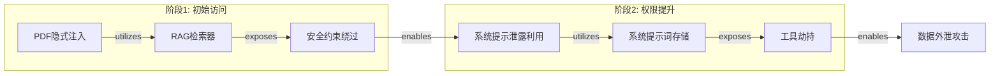
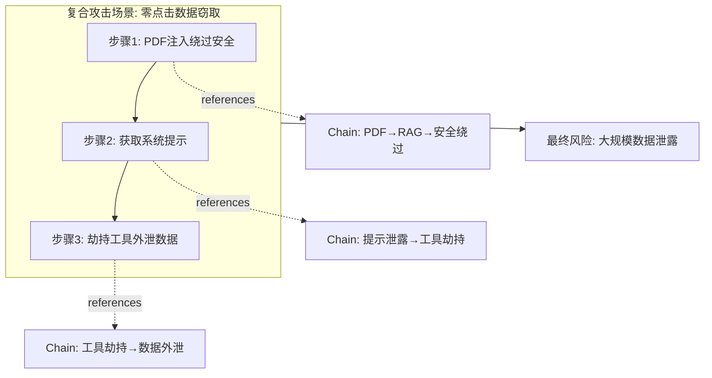
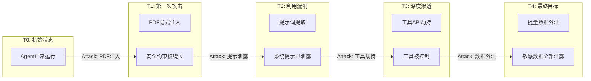

# 攻击链组合模型设计方案

## 问题分析

### 当前图结构
```
节点类型分布：
- Attack: 50 个
- Functionality: 12 个
- Risk: 13 个

边类型分布：
- utilizes (Attack → Func): 79 条
- exposes (Func → Risk): 33 条
- causes (Attack → Risk): 87 条
- escalates_to (Risk → Risk): 19 条
```

### 当前问题
1. **escalates_to 边的语义模糊**：目前 Risk→Risk 的 `escalates_to` 边表示风险之间的升级关系（如"安全约束绕过"→"恶意代码执行"），但这种关系：
   - 缺乏明确的触发条件
   - 没有记录是通过什么攻击手段实现的升级
   - 与实际攻击链的"阶段性"不匹配

2. **无法表达多阶段攻击**：如 APT 攻击中常见的"初始访问→权限提升→横向移动→数据外泄"链路

3. **小后果如何汇聚成大后果**：多个独立风险如何组合成更严重的复合风险

---

## 设计方案

### 方案 A：引入"攻击阶段"节点类型



**核心改动**：
- 新增边类型 `enables`（Risk → Attack）：表示某个风险为下一阶段攻击提供了前置条件
- 保留原有 Attack→Func→Risk 结构
- 移除语义模糊的 `escalates_to` 边

**优点**：
- 保持三元组结构不变
- 清晰表达攻击的阶段性
- 每个阶段都有明确的攻击手段

**缺点**：
- 需要识别哪些 Risk 能 enable 哪些 Attack（需要额外的知识或推理）

---

### 方案 B：引入"复合攻击场景"节点



**核心改动**：
- 新增节点类型 `Scenario`（攻击场景）
- 新增边类型 `references`（Scenario → Chain）
- 新增边类型 `achieves`（Scenario → Risk）

**优点**：
- 不改动现有三元组结构
- 可以灵活组合多个 Chain
- 清晰表达"多小汇聚成大"的关系

**缺点**：
- 增加了一层抽象
- Scene 的自动发现比较困难

---

### 方案 C：引入"风险累积分数"模型

```
┌─────────────────────────────────────────────────────────┐
│                    复合风险评估模型                       │
├─────────────────────────────────────────────────────────┤
│                                                         │
│   [安全约束绕过] ──┐                                     │
│        (30分)     │                                     │
│                   ├──▶ [复合风险: 供应链攻击] (100分)    │
│   [系统提示泄露] ──┤                                     │
│        (25分)     │                                     │
│                   │                                     │
│   [工具劫持] ─────┘                                     │
│        (45分)                                           │
│                                                         │
│   规则: 当累积分数 ≥ 阈值时，触发复合风险                 │
└─────────────────────────────────────────────────────────┘
```

**核心改动**：
- 为每个 Risk 节点添加"严重性分数"属性
- 定义"复合风险"节点及其触发阈值
- 新增边类型 `contributes_to`（Risk → CompositeRisk）

**优点**：
- 量化风险累积效应
- 可以用于自动发现"危险组合"
- 与安全评估实践（如 CVSS）相符

**缺点**：
- 分数设定主观性强
- 需要额外的评分数据

---

### 方案 D：时序攻击图（推荐）



**核心改动**：
- 新增节点类型 `State`（系统状态）
- 边直接表示"Attack"或"Exploit"
- 形成 State→Attack→State 的时序链

**优点**：
- 最接近真实攻击过程
- 每个状态转换都有明确的攻击手段
- 可以表达复杂的多路径攻击

**缺点**：
- 需要较大的图结构重构
- State 的定义需要标准化

---

## 推荐方案

> [!IMPORTANT]
> **推荐采用方案 A + 方案 C 的混合模式**

### 混合方案设计

```
┌────────────────────────────────────────────────────────────────┐
│                         攻击链组合模型                          │
├────────────────────────────────────────────────────────────────┤
│                                                                │
│  层级1: 基础三元组 (保持不变)                                    │
│  ┌─────────┐   utilizes   ┌──────────┐   exposes   ┌────────┐  │
│  │ Attack  │ ───────────▶ │  Func    │ ──────────▶ │  Risk  │  │
│  └─────────┘              └──────────┘             └────────┘  │
│                                                        │       │
│  层级2: 风险启用关系 (新增)                              │       │
│                                                        ▼       │
│                                               ┌──────────────┐ │
│                                               │   enables    │ │
│                                               │  (前置条件)   │ │
│                                               └──────┬───────┘ │
│                                                      │         │
│                                                      ▼         │
│  层级3: 下一阶段攻击                           ┌─────────┐     │
│                                               │ Attack' │     │
│                                               └─────────┘     │
│                                                                │
│  层级4: 复合风险 (新增)                                         │
│  ┌────────┐   contributes   ┌─────────────────┐               │
│  │ Risk 1 │ ──────────────▶ │                 │               │
│  └────────┘                 │  Composite Risk │               │
│  ┌────────┐   contributes   │  (累积阈值: 80) │               │
│  │ Risk 2 │ ──────────────▶ │                 │               │
│  └────────┘                 └─────────────────┘               │
│                                                                │
└────────────────────────────────────────────────────────────────┘
```

### 具体实施步骤

1. **Phase 1: 添加 `enables` 边**
   - 定义规则：哪些 Risk 可以 enable 哪些 Attack
   - 例如：`security_constraint_bypass` enables `tool_hijacking_attack`

2. **Phase 2: 定义 Composite Risk**
   - 创建新的 Risk 节点类型：`CompositeRisk`
   - 定义累积规则和阈值

3. **Phase 3: 更新提取逻辑**
   - 修改 `extract_graph.py` 以识别多阶段攻击模式
   - 自动推断 `enables` 关系

---

## 需要您的决策

1. **您倾向于哪种方案？**
   - A: 引入 `enables` 边（简单，可快速实施）
   - B: 引入 Scenario 节点（灵活，但需手动定义）
   - C: 风险累积分数（量化，但主观性强）
   - D: 时序攻击图（最接近真实，但重构较大）
   - 混合方案（推荐）

2. **`enables` 规则如何定义？**
   - 选项1: 手动定义（更准确，但工作量大）
   - 选项2: 让 LLM 推断（自动化，但可能有误）
   - 选项3: 基于共现关系推断（数据驱动）

3. **是否需要保留 `escalates_to` 边？**
   - 如果采用 `enables` 边，`escalates_to` 可能变得冗余
